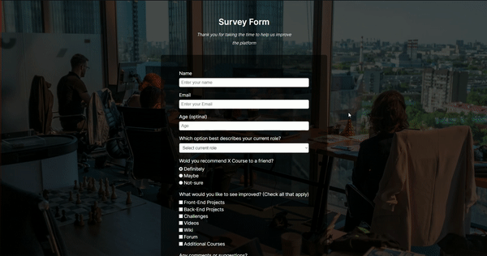
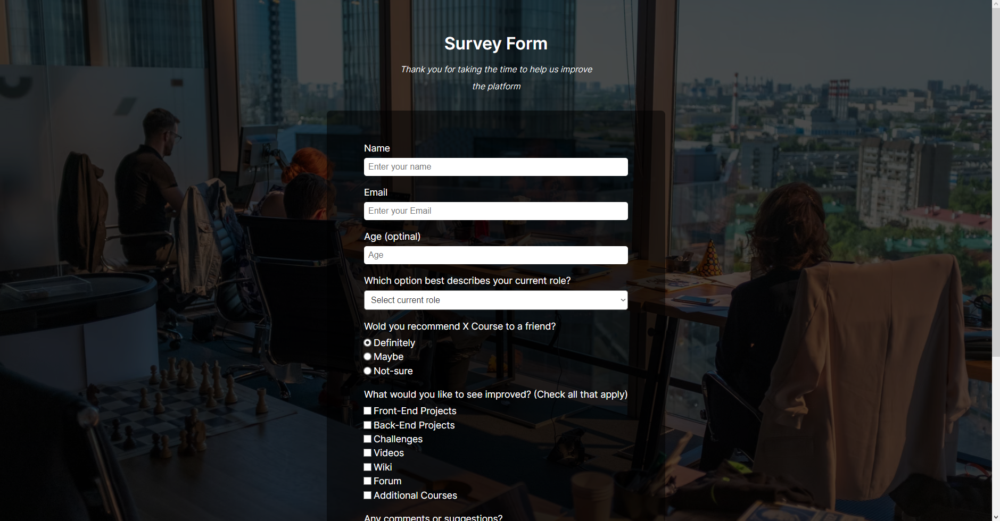
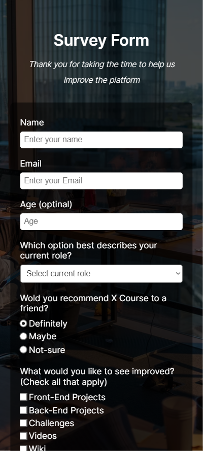

# Survey Form
Project built to apply all of the skills, principles, and concepts I've learned on the course Legacy Responsive Web Design from freeCodeCamp.org

## Desktop Version

## Mobile Version
